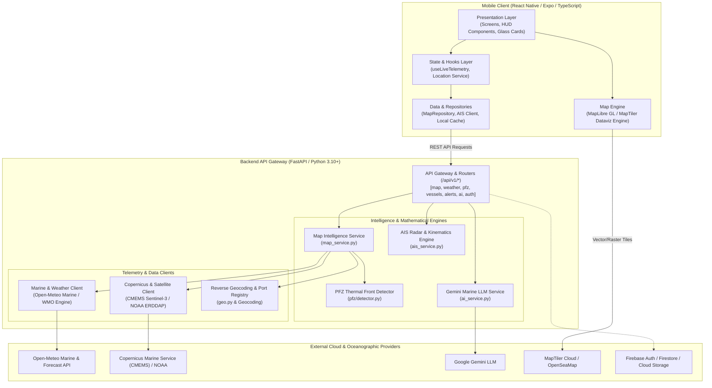

# 🌊 VARUNA — Marine Intelligence System

> *A premium, AI-powered maritime decision-support system designed to understand the ocean.*

**Project VARUNA** transforms complex oceanographic telemetry (Potential Fishing Zones, bathymetric contours, wave dynamics, sea surface temperature, chlorophyll concentration, AIS vessel kinematics, and cyclone paths) into calm, explainable AI intelligence for vessel masters, commercial operators, and maritime authorities.

---

## 📑 Table of Contents

- [🏛️ System Architecture](#️-system-architecture)
- [⚡ Core Intelligence Engines](#-core-intelligence-engines)
- [🛠️ Tech Stack](#️-tech-stack)
- [📂 Project Directory Structure](#-project-directory-structure)
- [🚀 Quick Start Guide](#-quick-start-guide)
  - [1. Backend Setup (FastAPI)](#1-backend-setup-fastapi)
  - [2. Frontend Setup (React Native / Expo)](#2-frontend-setup-react-native--expo)
- [📡 API Reference & Contracts](#-api-reference--contracts)
  - [Endpoints Directory](#endpoints-directory)
  - [Sample Map Intelligence Payload](#sample-map-intelligence-payload)
- [⚙️ Environment Configuration](#️-environment-configuration)
  - [Backend (`varuna-backend/.env`)](#backend-varuna-backendenv)
  - [Frontend (`Varuna-Frontend/.env`)](#frontend-varuna-frontendenv)
- [🎨 Design Ethos & Visual Identity](#-design-ethos--visual-identity)
- [🧪 Testing & Quality Assurance](#-testing--quality-assurance)
- [🗺️ Future Engineering Roadmap](#️-future-engineering-roadmap)

---

## 🏛️ System Architecture



---

## ⚡ Core Intelligence Engines

### 1. Potential Fishing Zone (PFZ) Detection Engine
* **Thermal Front Edge-Detection**: Identifies significant horizontal Sea Surface Temperature (SST) gradients ($\Delta \text{SST} \ge 0.4^\circ\text{C}$).
* **Phytoplankton Confluence**: Integrates Copernicus Sentinel-3 Chlorophyll-a concentrations ($1.5 - 4.5\text{ mg/m}^3$) indicating high-density marine food chains.
* **Target Species Prediction**: Dynamic classification mapping ocean depth and SST to commercial fish species (Yellowfin Tuna, Skipjack, Indian Mackerel, Seer Fish).
* **Micro-Hotspot Generation**: Generates 6-vertex bounding polygon contours and localized coordinates within 1.5–6.0 NM of vessel position.

### 2. AIS Radar & Collision Avoidance Engine
* **Kinematic Dead-Reckoning**: Computes 30-minute forward trajectory projections using speed over ground (SOG) and course over ground (COG).
* **CPA & TCPA Calculations**: Evaluates Closest Point of Approach (**CPA**) and Time to CPA (**TCPA**) across regional coastal vessel traffic.
* **Collision Guard Alerts**: Automatically triggers visual and advisory alerts when $\text{CPA} < 1.0\text{ NM}$ and $\text{TCPA} < 15\text{ min}$.

### 3. Dynamic Marine Risk & Safe Route Corridors
* **Multi-Factor Risk Scoring**: Evaluates swell wave height ($H_s$), wave period ($T_p$), wind speed, and current shear to output `LOW`, `MODERATE`, or `HIGH` risk ratings.
* **Navigation Corridors**: Calculates safe routes and waypoint corridors steering clear of shallow bathymetry, squall lines, and dangerous current shears.

### 4. Explainable Marine AI Assistant
* **Contextual Maritime Synthesis**: Powered by Google Gemini LLM to interpret complex weather systems, barometric pressure changes, and fishing advisories.
* **Explainable Confidence Rating**: Backs every recommendation with transparent factor breakdowns and safety margins.

---

## 🛠️ Tech Stack

| Layer | Technologies |
| :--- | :--- |
| **Mobile Frontend** | **React Native 0.78**, **Expo SDK 54**, **TypeScript 5.3+**, **React Native Reanimated 3.16**, **Expo Haptics**, **Expo Video / AV**, **Lucide Icons** |
| **Cartography & Maps** | **MapLibre GL Native**, **MapTiler Dataviz Dark / Hybrid**, **OpenSeaMap Seamarks** |
| **Backend Framework** | **Python 3.10+**, **FastAPI 0.110+**, **Uvicorn ASGI Server**, **Pydantic v2** |
| **Async Network & IO** | **HTTPX** (Connection pooling, in-memory TTL caching, parallel non-blocking requests) |
| **Cloud & Storage** | **Firebase Admin SDK**, **Google Cloud Firestore**, **Google Cloud Storage (GCS)** |
| **AI / Decision Support** | **Google Gemini Pro / Flash API** |
| **Testing & Tooling** | **Pytest**, **pytest-asyncio**, **TypeScript Compiler (`tsc`)** |

---

## 📂 Project Directory Structure

```
Project-VARUNA/
├── README.md                        # Master Project Documentation
├── Varuna-Frontend/                 # React Native Mobile Application (Expo)
│   ├── App.tsx                      # App root with fonts, atmospheric video & error boundary
│   ├── package.json                 # Frontend dependencies and scripts
│   ├── tsconfig.json                # TypeScript compiler configuration
│   └── src/
│       ├── presentation/            # User Interface & Visual Layer
│       │   ├── screens/
│       │   │   ├── HomeScreen.tsx         # 4-metric telemetry HUD, AI insight ring, search
│       │   │   ├── MapScreen.tsx          # Multi-layer ocean canvas, PFZ polygons, AIS radar
│       │   │   ├── VarunaAiScreen.tsx     # Marine AI conversational assistant
│       │   │   ├── AlertsScreen.tsx       # Cyclone warnings, swell alerts, advisories
│       │   │   └── ProfileScreen.tsx      # Vessel specs, offline bathymetric tile sync
│       │   └── components/
│       │       ├── brand/                 # VarunaOrb, AtmosphericBackground, Wordmark
│       │       ├── conditions/            # Live ocean metric cards, sparklines
│       │       ├── insights/              # Explainable AI modals, confidence dials
│       │       ├── map/                   # VarunaMapLibreEngine, MapFloatingControls, SelectedLocationSheet
│       │       └── navigation/            # Floating glass BottomNavBar
│       ├── domain/models/           # Strongly-typed domain models
│       │   ├── mapIntelligence.ts   # Conditions, weather forecasts, PFZ zones, safe routes
│       │   ├── vessel.ts            # AIS live vessel telemetry & collision risk models
│       │   └── location.ts          # Maritime ports, coastal cities, coordinates
│       ├── data/                    # Data access, hooks, and services
│       │   ├── api/                 # Axios/Fetch HTTP clients for all backend endpoints
│       │   ├── hooks/               # useLiveTelemetry.ts (debounced GPS + marine sync)
│       │   ├── repositories/        # mapRepository.ts (data normalization & caching)
│       │   └── services/            # locationService.ts (high-accuracy GPS), telemetryService.ts
│       └── theme/                   # Colors, typography, spacing tokens
│
└── varuna-backend/                  # FastAPI Marine Intelligence Backend
    ├── requirements.txt             # Backend Python dependencies
    ├── README.md                    # Backend specific documentation
    └── app/
        ├── main.py                  # FastAPI entrypoint, middleware, and lifecycle handlers
        ├── core/                    # App configuration (config.py) and Firebase init
        ├── api/
        │   ├── router.py            # API v1 router aggregator
        │   └── v1/                  # Individual route modules
        │       ├── map.py           # /map/intelligence, /pfz-zones, /conditions, /search-locations
        │       ├── vessels.py       # /vessels/radar (AIS live tracking & CPA)
        │       ├── ai.py            # /ai/chat (Conversational marine query handler)
        │       ├── weather.py       # /weather/forecast
        │       ├── pfz.py           # /pfz/recommendations
        │       ├── alerts.py        # /alerts/active
        │       ├── routes.py        # /routes/safe-corridors
        │       └── health.py        # Health & readiness probes
        ├── intelligence/            # Analytical and mathematical modules
        │   └── pfz/
        │       └── detector.py      # SST gradients, thermal fronts & chlorophyll scoring
        ├── services/                # Upstream integrations and business logic
        │   ├── map_service.py       # Map intelligence orchestration & risk evaluation
        │   ├── ais_service.py       # AIS kinematics, dead-reckoning & collision avoidance
        │   ├── marine_weather_client.py # Open-Meteo marine client & port registry
        │   ├── satellite_ocean_client.py # Copernicus CMEMS & NOAA ERDDAP client
        │   ├── reverse_geocoding_service.py # Coastal reverse geocoding
        │   └── ai_service.py        # Gemini AI integration
        ├── schemas/                 # Pydantic validation schemas
        └── utils/                   # Geodesic math, haversine distance, bearings
```

---

## 🚀 Quick Start Guide

### 1. Backend Setup (FastAPI)

#### Prerequisites
* Python 3.10 or higher
* `pip` and `virtualenv`

#### Installation Steps
```bash
# 1. Navigate to the backend directory
cd varuna-backend

# 2. Create and activate a Python virtual environment
# Windows (PowerShell):
python -m venv venv
.\venv\Scripts\activate

# Linux / macOS:
python3 -m venv venv
source venv/bin/activate

# 3. Install required Python packages
pip install -r requirements.txt

# 4. Copy environment configuration
cp .env.example .env

# 5. Start the backend development server
uvicorn app.main:app --reload --host 0.0.0.0 --port 8000
```

* **API Root**: `http://localhost:8000/`
* **Health Check**: `http://localhost:8000/health`
* **Interactive Swagger UI**: `http://localhost:8000/api/v1/docs`
* **Interactive ReDoc**: `http://localhost:8000/api/v1/redoc`

---

### 2. Frontend Setup (React Native / Expo)

#### Prerequisites
* Node.js (v18+) & npm
* Android Studio / Android Emulator or physical Android device with Expo Go

#### Installation Steps
```bash
# 1. Navigate to the frontend directory
cd Varuna-Frontend

# 2. Install dependencies
npm install

# 3. Start Expo development server
npm run start

# 4. Launch on Android Emulator / Device
npm run android

# 5. Launch on Web Browser (WebGL / MapLibre preview)
npm run web

# 6. Run TypeScript typecheck
npm run tsc
```

---

## 📡 API Reference & Contracts

### Endpoints Directory

| Method | Endpoint | Description |
| :--- | :--- | :--- |
| `GET` | `/health` | Service health status check |
| `POST` | `/api/v1/map/intelligence` | Full ocean physics, PFZ clusters, weather & risk assessment |
| `GET` | `/api/v1/map/search-locations` | Search coastal cities, ports, or coordinates |
| `GET` | `/api/v1/map/pfz-zones` | Retrieve Potential Fishing Zones for coordinates |
| `GET` | `/api/v1/map/conditions` | Live ocean temperature, wave height, swell period, wind & current |
| `GET` | `/api/v1/vessels/radar` | AIS live vessel radar feeds, dead reckoning & CPA collision risks |
| `POST` | `/api/v1/ai/chat` | Conversational maritime decision-support query |
| `GET` | `/api/v1/alerts/active` | Active cyclone advisories and navigation warnings |
| `POST` | `/api/v1/routes/safe-corridors` | Calculate safe navigational corridors and waypoints |

---

### Sample Map Intelligence Payload

#### Request: `POST /api/v1/map/intelligence`
```json
{
  "latitude": 17.38,
  "longitude": 83.25,
  "radius_km": 50.0
}
```

#### Response (Excerpt):
```json
{
  "coordinates": { "latitude": 17.38, "longitude": 83.25 },
  "conditions": {
    "sea_temperature": 28.4,
    "wave_height": 1.2,
    "wave_direction": "SE",
    "wave_speed": 14.0,
    "wind_direction_deg": 125,
    "swell_period_sec": 9.2,
    "chlorophyll": 2.4,
    "current_speed_knots": 1.4,
    "current_direction_deg": 90,
    "salinity_psu": 33.2
  },
  "risk": {
    "score": 14,
    "level": "LOW",
    "summary": "Swell at 1.2m and currents at 1.4 kts indicate low operating risk in Central Bay of Bengal."
  },
  "pfz": {
    "confidence_score": 87,
    "target_species": ["Yellowfin Tuna", "Skipjack", "Indian Mackerel"],
    "zones": [
      {
        "id": "pfz-vizag-alpha",
        "name": "Central Bay of Bengal (Visakhapatnam Front)",
        "latitude": 17.50,
        "longitude": 83.55,
        "confidence_score": 87,
        "sea_surface_temp": 28.4,
        "chlorophyll_mg_m3": 2.4,
        "target_species": ["Yellowfin Tuna", "Skipjack", "Indian Mackerel"]
      }
    ]
  }
}
```

---

## ⚙️ Environment Configuration

### Backend (`varuna-backend/.env`)
```env
PROJECT_NAME="VARUNA Marine Intelligence API"
VERSION="1.0.0"
API_V1_PREFIX="/api/v1"
DEBUG=True
PORT=8000
HOST="0.0.0.0"

# Google Gemini API Key
GEMINI_API_KEY="your-gemini-api-key"

# Firebase & GCP Configuration
FIREBASE_PROJECT_ID="project-varuna"
FIREBASE_CREDENTIALS_PATH=""
GCP_PROJECT_ID="project-varuna"
GCS_BUCKET_NAME="project-varuna-marine-data"
```

### Frontend (`Varuna-Frontend/.env`)
```env
EXPO_PUBLIC_API_URL="http://localhost:8000/api/v1"
EXPO_PUBLIC_MAPTILER_API_KEY="your-maptiler-api-key"
```

---

## 🎨 Design Ethos & Visual Identity

* **Visual Identity**: Oceanic Intelligence (*Dark Mode First*, Luminous Navies `#02060e`, Cyan `#22d3ee`, Indigo `#6366f1`).
* **Signature Brand Anchor**: The **VARUNA Orb** — a dimensional glass sphere with an animated internal horizon wave line and controlled aura.
* **Typography Contrast**: *Playfair Display* for editorial headlines and *Inter* for precision telemetry data.
* **Liquid Glass & Atmospheric Video**: Persistent 60 FPS oceanic depth background with translucent frosted overlays (`expo-blur`).
* **Explainable AI**: Every recommendation is paired with transparent factor matching, confidence scoring, and safety margins.

---

## 🧪 Testing & Quality Assurance

### Run Backend Unit & Async Tests
```bash
cd varuna-backend
pytest tests/
```

### Run Frontend Static Type Checking
```bash
cd Varuna-Frontend
npm run tsc
```

---

## 🗺️ Future Engineering Roadmap

```mermaid
gantt
    title Project VARUNA Engineering Roadmap
    dateFormat  YYYY-Q#
    section Phase 1: Real-time & Offline Core
    Offline MBTiles & Bathymetry Caching      :done, p1_1, 2026-Q1, 2026-Q2
    Live AIS WebSocket Stream Ingestion       :active, p1_2, 2026-Q2, 2026-Q3
    section Phase 2: Edge ML & Spatial Intelligence
    On-Device ONNX PFZ Inference             :p2_1, 2026-Q3, 2026-Q4
    Dynamic Weather-Routing & Fuel Optimizer  :p2_2, 2026-Q3, 2026-Q4
    Multilingual Voice Interface (Tamil/Telugu):p2_3, 2026-Q4, 2027-Q1
    section Phase 3: Hardware & Satellite Uplink
    NavIC / NTN Direct-to-Cell SOS Mesh       :p3_1, 2027-Q1, 2027-Q2
    COLREGs Autonomous Collision Guard        :p3_2, 2027-Q2, 2027-Q4
```

### Phase 1: Real-Time Stream & Offline Storage
* **AIS NMEA Stream Pipeline**: WebSockets connected directly to terrestrial AIS base stations and coastal receivers.
* **Pre-packaged Vector Tile Caching**: SQLite/MBTiles database enabling full bathymetric and navigation functionality up to 200 NM offshore without cellular coverage.

### Phase 2: Advanced AI & Maritime Optimization
* **Weather-Routing & Fuel Optimization Algorithm**: Graph-search corridor solver factoring in live ocean currents to compute minimum-fuel departure windows.
* **On-Device Edge ML**: Quantized ONNX / TFLite models running locally on Android devices for offline hotspot detection.
* **Multilingual Voice-First Interface**: Audio-in/audio-out capabilities in regional coastal languages (*Tamil, Telugu, Malayalam, Bengali, Odia, Hindi*).

### Phase 3: Autonomous Safety & Satellite Comms
* **NavIC & Satellite Direct-to-Cell (NTN) Uplink**: Integration with NavIC satellite messengers for emergency alerts.
* **COLREGs Autonomous Collision Guard**: Automated marine radar guard zones alerting on crossing/overtaking collision hazards according to IMO regulations.
